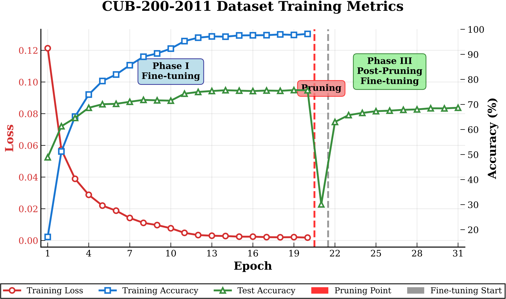
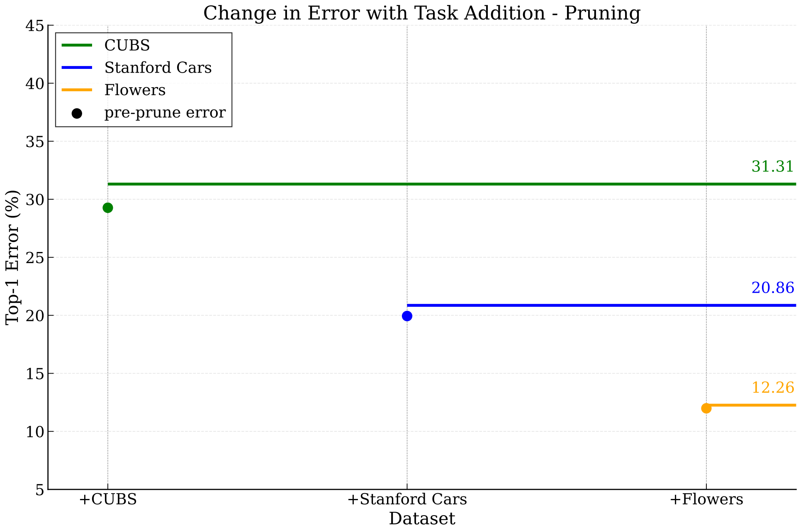
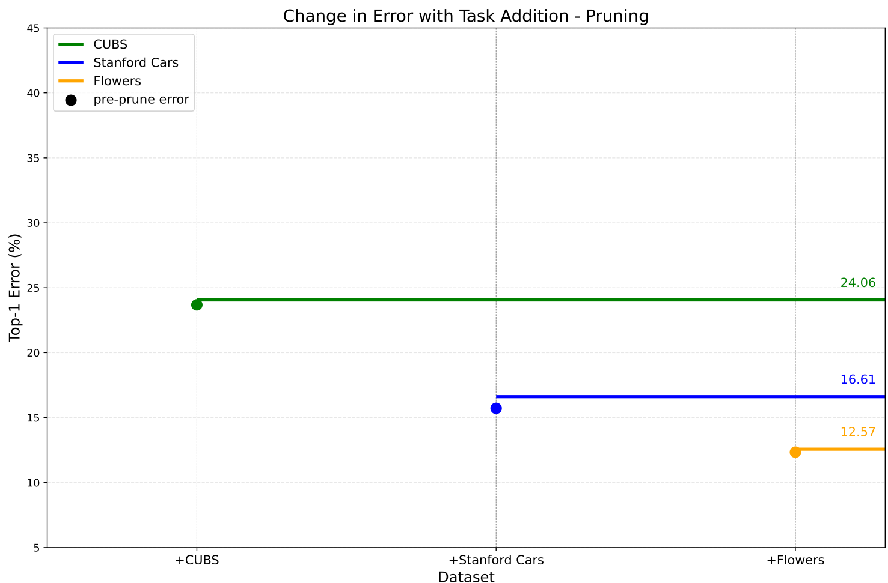

# PackNet-Jittor: 基于Jittor的PackNet算法实现

本项目是对CVPR 2018论文《PackNet: Adding Multiple Tasks to a Single Network by Iterative Pruning》的完整复现，使用Jittor深度学习框架实现。

## 📖 论文简介

**PackNet**的核心思想是利用大型神经网络中的冗余参数，通过"迭代剪枝和重训练"的循环，将多个任务依次"打包"进一个网络。具体来说：

1. **避免灾难性遗忘**：旧任务的参数被固定，新任务使用释放出的参数
2. **参数共享**：通过剪枝释放参数供新任务使用
3. **多任务学习**：一个网络可以学习多个相关任务

## 🏗️ 项目结构

```
📦 packnet-jittor/
├── 📄 dataset.py          # 统一的数据加载器
├── 📄 pruning.py          # PackNet剪枝算法核心实现
├── 📄 main.py             # 主训练脚本
├── 📄 test_basic.py       # 基础功能测试
├── 📄 requirements.txt    # 项目依赖
├── 📄 README.md           # 项目说明
├── 📁 data/               # 数据集目录
│   ├── 📁 cubs_cropped/   # CUB-200-2011鸟类数据集
│   ├── 📁 stanford_cars_cropped/  # Stanford Cars数据集
│   └── 📁 flowers/        # Oxford Flowers数据集
└── 📁 checkpoints/        # 模型和掩码保存目录
```

## 🚀 快速开始

### 1. 环境准备

```bash
# 安装依赖
pip install -r requirements.txt
```

### 2. 数据准备

确保数据集已下载并按以下结构组织：

```
data/
├── cubs_cropped/
│   ├── train/
│   │   ├── 001.Black_footed_Albatross/
│   │   ├── 002.Laysan_Albatross/
│   │   └── ...
│   └── test/
├── stanford_cars_cropped/
│   ├── train/
│   └── test/
└── flowers/
    ├── train/
    └── test/
```

### 3. 测试数据加载

```bash
# 测试数据集结构和基础功能
python test_basic.py
```

### 4. 运行PackNet实验

```bash
# 运行完整的多任务学习实验
python main.py
```

## 🔬 实验设置

### 任务序列
- **任务1**: CUBS-200-2011 (鸟类分类，200个类别)
- **任务2**: Stanford Cars (汽车分类，196个类别)  
- **任务3**: Oxford Flowers (花卉分类，102个类别)

### 剪枝策略
- **初始剪枝**: 75% (在ImageNet预训练模型上)
- **任务1剪枝**: 75%
- **任务2剪枝**: 75%  
- **任务3剪枝**: 75%

### 网络架构
- **基础模型**: VGG-16 (ImageNet预训练)
- **分类器**: 为每个任务添加独立的分类头

### ⚠️简化流程
- 为了快速验证，暂时没在ImageNet上重训练，也没有对ImageNet的性能进行测试

## 📊 核心算法

### 1. 数据预处理 (`dataset.py`)

严格按照论文第4节实现：

- **CUBS & Cars**: 直接缩放到224×224
- **Flowers**: 短边缩放到256，然后224×224裁剪
- **数据增强**: 训练时随机水平翻转

```python
# 创建数据加载器
train_loader, num_classes = create_dataloader(
    dataset_name='cubs',
    data_root='data',
    split='train',
    batch_size=32
)
```

### 2. PackNet剪枝算法 (`pruning.py`)

核心剪枝函数实现：

```python
# 对模型进行剪枝
new_mask = PackNetPruning.prune_model(
    model=model,
    pruning_ratio=0.75,  # 剪枝75%的权重
    previous_masks=previous_task_masks  # 保护之前任务的权重
)

# 应用掩码冻结权重
PackNetPruning.freeze_weights_by_mask(model, previous_masks)
```

### 3. 多任务训练流程 (`main.py`)

完整的PackNet训练流程：

1. **初始剪枝**: 对VGG-16进行75%剪枝
2. **任务循环**:
   - 冻结之前任务的权重
   - 训练当前任务
   - 剪枝当前任务的权重
   - 微调恢复性能
3. **最终评估**: 验证所有任务的性能保持

## 🎯 实验结果


### Jittor 复现结果 vs. 论文报告结果 (Top-1 准确率 %)

| **任务** | **Jittor 复现 (本项目)** | PyTorch复现 | **原论文 (VGG-16, 75%剪枝)** |
| :--- | :---: | :---: | ----- |
| CUBS | 68.69% | 75.94% | 75.05% (24.95% 错误率) |
| Stanford Cars | 79.14% | 83.39% | 84.25% (15.75% 错误率) |
| Flowers | 87.74% | 87.43% | 90.25% (9.75% 错误率) |

* ImageNet剪枝后没有进行重训练使性能恢复。ImageNet的参数对后续任务都会用到，这可能影响性能。
* 深度学习框架不同。

### 训练过程（CUBS）



训练完整log在log.txt中。总训练时长115min左右。

### 缓解灾难性遗忘效果

#### Jittor



#### PyTorch复现



## 🔧 核心特性

### ✅ 已实现功能

1. **完整的数据加载器**
   - 支持三个细粒度分类数据集
   - 按照论文要求的预处理方法
   - 自动从目录结构解析标签

2. **PackNet核心算法**
   - 基于重要性的权重剪枝
   - 掩码管理和权重冻结
   - 支持多任务连续学习

3. **训练和评估框架**
   - 完整的训练循环
   - 性能评估和结果保存
   - 模型和掩码持久化

### 🎛️ 可配置参数

```python
# 训练配置
self.initial_lr = 0.001           # 初始学习率
self.batch_size = 32              # 批大小
self.num_epochs_per_task = 50     # 每个任务的训练轮数
self.num_epochs_finetune = 10     # 剪枝后微调轮数

# 任务配置  
self.task_list = ['cubs', 'cars', 'flowers']
self.pruning_ratios = [0.75, 0.75, 0.75]
```

## 🚨 注意事项

1. **计算资源**: 完整实验需要GPU支持，建议至少8GB显存
2. **数据集准备**: 确保数据集目录结构正确
3. **Jittor安装**: 需要正确安装Jittor支持，Jittor的安装需要折腾

⚠️尝试在DCU上安装Jittor并训练，但内核报错

## 📚 参考文献

```bibtex
@inproceedings{mallya2018packnet,
  title={PackNet: Adding Multiple Tasks to a Single Network by Iterative Pruning},
  author={Mallya, Arun and Lazebnik, Svetlana},
  booktitle={Proceedings of the IEEE Conference on Computer Vision and Pattern Recognition},
  pages={7765--7773},
  year={2018}
}
```
